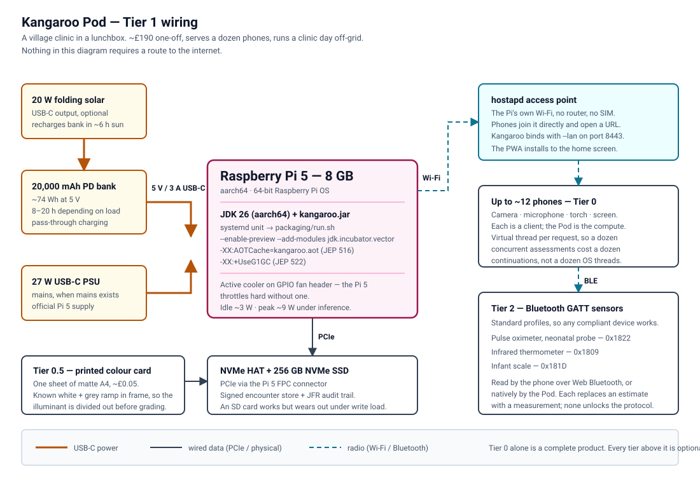

# Bill of materials

**The bill of materials starts at zero new hardware.** Everything in Tier 0 is something the person
using Kangaroo already owns, and Tier 0 is a complete, working product — not a demo mode.

Each tier adds capability without ever becoming a requirement. A health worker with only a phone
gets the full WHO IMNCI assessment. A pulse oximeter makes the oxygen saturation objective rather
than estimated; it does not unlock the protocol.

---

## Tier 0 — nothing new

| Item | Quantity | Cost | Role |
|---|---|---|---|
| A smartphone (Android 8+ or iOS 14+, any price bracket) | 1 | £0 | Camera, microphone, torch, screen, and the client itself |
| A laptop or desktop (8 GB RAM, no GPU needed) | 1 | £0 | Runs the Kangaroo process; optional if the phone pairs to a Pod |

**Total: £0.**

The phone runs the client in its browser and installs to the home screen as a progressive web app —
no app store, no install friction for a health worker with 400 MB of storage left. It pairs to the
laptop over the local network by opening a URL.

If you only have a phone and no laptop, the phone can point at a Pod (Tier 1) or at a laptop
belonging to the clinic. There is no configuration beyond typing an address.

---

## Tier 0.5 — one sheet of paper

| Item | Quantity | Cost | Role |
|---|---|---|---|
| The printed colour-reference card | 1 | ~£0.05 | Turns a phone camera into a crude bilirubinometer |
| A4 or Letter paper, matte, any inkjet or laser printer | 1 sheet | — | — |

The card is a free PDF in this repository: [`docs/colour-card.md`](docs/colour-card.md) explains what
it is, how to print it, and how to check that your printer produced something usable.

**Why it matters.** A phone camera does not measure colour; it measures colour *under whatever light
happens to be there*, with whatever white balance the manufacturer's firmware chose. A daylight
window, a paraffin lamp and a fluorescent tube produce three different photographs of the same baby.
The card gives the pipeline a known reference in the same frame, so the illuminant can be divided
out before anything is graded. Without it, a jaundice reading is a reading of the lighting.

The card is also what lets Kangaroo **refuse**: if the card is not visible enough to correct the
colour, the grader says "make sure the whole card is in the photo and take it again" instead of
producing a number it cannot stand behind.

---

## Tier 1 — the Pod

A village clinic in a lunchbox. Its own Wi-Fi access point, serves a dozen phones, runs for a day
off-grid, and syncs when a signal appears.

| Item | Quantity | Approx. cost | Notes |
|---|---|---|---|
| Raspberry Pi 5, 8 GB | 1 | £75 | 4 GB works; 8 GB is needed for a larger on-device model |
| Official 27 W USB-C power supply | 1 | £12 | |
| NVMe HAT + 256 GB NVMe SSD | 1 | £45 | An SD card works but wears out under write load |
| 20,000 mAh USB-C PD power bank | 1 | £35 | About a day of continuous serving |
| 20 W folding solar panel with USB-C | 1 | £30 | Optional; recharges the bank in ~6 hours of sun |
| Active cooler | 1 | £5 | The Pi 5 throttles hard without one |
| 3D-printed or off-the-shelf case | 1 | £8 | A sandwich box genuinely works |
| **Total** | | **~£190** | one-off, serves a whole community |

**Setup.** Install a 64-bit Raspberry Pi OS, install a JDK 26 build for aarch64, copy the JAR, and
run it as a systemd service with `--lan`. [`packaging/run.sh`](packaging/run.sh) is the launch script;
[`packaging/aot.sh`](packaging/aot.sh) produces the AOT cache that gets startup under control on a Pi.

Configure the Pi as a Wi-Fi access point with `hostapd` so phones can join it directly, with no
router and no internet. Nothing in Kangaroo needs a route to the outside world.

**Power budget.** The Pi 5 idles around 3 W and peaks around 9 W under inference. A 20,000 mAh bank
at 5 V holds roughly 74 Wh, giving 8 to 20 hours depending on load — a full clinic day with margin.

---

## Tier 2 — Bluetooth sensors

Objective numbers instead of estimates. All use standard Bluetooth GATT profiles, so any compliant
device works; these are examples, not requirements.

| Item | Approx. cost | Replaces | GATT profile |
|---|---|---|---|
| Bluetooth pulse oximeter with a neonatal probe | £40 | "does the baby look blue?" | Pulse Oximeter Service (0x1822) |
| Bluetooth infrared thermometer | £18 | "does the baby feel hot?" | Health Thermometer (0x1809) |
| Bluetooth infant scale | £45 | an unweighed baby | Weight Scale (0x181D) |
| **Total** | **~£103** | | |

A neonatal SpO₂ probe matters more than the oximeter body: adult finger clips do not read reliably on
a newborn, and a bad reading is worse than none.

Phones read these over Web Bluetooth directly from the client. On a Pod they are read natively.

---

## Tier 3 — the phone as the whole computer

No extra hardware at all: an aarch64 Android phone running a JDK 26 build under Termux, with the
browser pointed at `localhost`. The full Java 26 clinical core on the handset, with no laptop and no
Pod present.

This is the most constrained configuration and the one that proves the point about the deterministic
floor: a phone with 2 GB of free RAM will not run a multi-billion-parameter vision model, and it does
not need to. The WHO rule engine and the pure-Java gradient-boosted head run in milliseconds and
produce the same traffic light.

---

## What you do not need

Worth stating explicitly, because the usual answer to "AI for health" involves most of it:

- **No internet connection.** Not for setup, not for use. The models and reference data ship in the JAR.
- **No cloud account, no API key, no subscription.** The cloud rung is optional and is bring-your-own-key.
- **No GPU.** The deterministic path is milliseconds on a Pi. A GPU only speeds up the optional language model.
- **No app store.** The client installs from a URL.
- **No Docker, no Node, no Python** at runtime. One JAR and a JDK.
- **No proprietary dongle, no vendor lock-in, no calibration service.**

---

## Consumables, for a real deployment

Not part of the software, but a deployment that ignores them is a deployment that fails in month two.

| Item | Notes |
|---|---|
| Printed colour cards | One per health worker, replaced when they get dirty or fade. They will. |
| Chlorhexidine 7.1% gel | WHO-recommended cord care in high-mortality settings |
| Amoxicillin dispersible tablets or suspension | For the PSBI outpatient regimen |
| Gentamicin 10 mg/ml + syringes | Same; requires a trained injector |
| ORS sachets | |
| A phone charging arrangement | The commonest reason a digital health tool stops being used |
