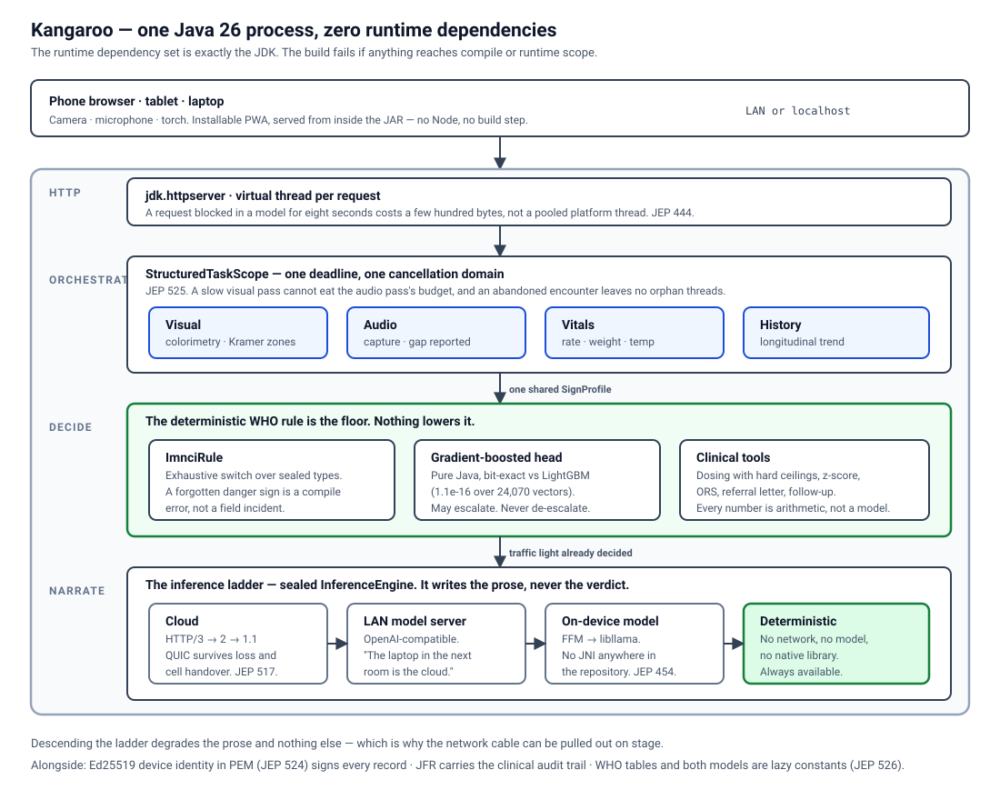

# Kangaroo

[](https://github.com/Marc-Dvci/Kangaroo/actions/workflows/build.yml)

**An offline newborn-watch platform for parents and community health workers, built entirely in Java 26.**

Two point three million newborns die within twenty-eight days of birth. Three quarters of them in
sub-Saharan Africa and South Asia; three quarters within the first week. Almost all of it is
preventable, and the bottleneck is not medicine — it is **detection**. Someone has to notice, in
time, that this baby is not merely sleepy but lethargic; that this yellow has reached the soles and
not just the face; that fifty-eight breaths a minute is fine and sixty-two is not.

The people positioned to notice are a **parent** who has never done this before and a **community
health worker** whose training decays between visits and who carries no diagnostic equipment. Both
are, at the moment it matters, offline.

Kangaroo is the tool that notices. It runs on a laptop, a phone or a Raspberry Pi with the network
cable pulled out, and it is written top to bottom in Java 26 — including the parts the industry
assumes must be C++ or Python.

The name is the medicine: **kangaroo mother care**, skin-to-skin contact, is one of the
highest-impact and lowest-technology neonatal interventions the WHO endorses. This software is meant
to sit alongside it, not above it.

---

## Table of contents

- [What it does](#what-it-does)
- [Try it in two minutes](#try-it-in-two-minutes)
- [Every JDK 26 JEP, and where it lives](#every-jdk-26-jep-and-where-it-lives)
- [Architecture](#architecture)
- [The safety argument](#the-safety-argument)
- [What is proved, and how](#what-is-proved-and-how)
- [Building from source](#building-from-source)
- [Optional: the on-device model](#optional-the-on-device-model)
- [Bill of materials](#bill-of-materials)
- [Scope](#scope)
- [Repository layout](#repository-layout)
- [Licence and acknowledgements](#licence-and-acknowledgements)

---

## What it does

One clinical engine, two front doors.

### Parent mode — the first 28 days

A first-time parent at 3 a.m. holding a baby that seems *off* currently has two options: a search
engine that will terrify them, or a phone call they feel guilty making. Parent mode is the third.

- A **two-minute check**: three plain-language questions, a tap-to-count breathing measure, a
  photograph or two, and ten seconds of the baby's cry.
- A result with a colour and a sentence: *carry on*, *see someone today*, *go now* — and a button
  that **reads the plan aloud**, because a meaningful share of the people this is for do not read
  comfortably in any language.
- **It never says the baby is fine.** It says nothing it can see needs a clinician today, and it
  always ships the return-immediately list alongside.
- It escalates on a **lower threshold** than health-worker mode, because a parent has less signal
  and more at stake.

### Health-worker mode — the WHO IMNCI young-infant assessment

- Seven guided captures, a counted respiratory rate, a ten-second cry recording, and structured intake.
- **The camera as a second opinion on the breathing rate.** Fifteen seconds pointed at the chest
  measures the rate independently of the count — and when the two disagree, that disagreement is
  reported rather than silently resolved. No video is sent: each frame becomes one movement number
  on the device, so a few hundred floats travel where a video would not.
- The full **WHO IMNCI danger-sign classification** with a red/amber/green result and every finding
  traced back to the words that produced it.
- **Five deterministic clinical tools**: weight-for-age z-score, medication dosing with hard
  ceilings, ORS volume, referral letter, follow-up date.
- The **"referral not possible"** branch — the WHO 2015 simplified outpatient antibiotic regimen for
  when transfer is genuinely impossible, which is the branch that decides outcomes and the one most
  tools leave out.
- A printable **referral letter** generated with the result, because a health worker with no signal
  cannot come back for it.

Both modes share the protocol, the models, the audit trail and the tools. They differ in vocabulary,
in pacing, and in how readily they escalate.

---

## Try it in two minutes

You need a JDK 26. Nothing else — no Node, no Python, no Docker, no model files.

```bash
git clone https://github.com/Marc-Dvci/Kangaroo
cd Kangaroo
./mvnw package
java --enable-preview --add-modules jdk.incubator.vector \
     --enable-native-access=ALL-UNNAMED \
     -jar target/kangaroo.jar --open
```

Then open <http://localhost:8443/>. Turn off your Wi-Fi first if you like — it makes the point better.

That is the whole product. If you also want the optional on-device language model, one command
fetches it and the native runtime, pinned and hash-checked:

```bash
java -jar target/kangaroo.jar --setup            # add --dry-run to see the plan and the size first
```

Then start it exactly as above: `--model` and `--projector` default to what setup installed.

To let a phone on the same network use its camera and pair with your laptop:

```bash
java --enable-preview --add-modules jdk.incubator.vector \
     --enable-native-access=ALL-UNNAMED -jar target/kangaroo.jar --lan
```

The client is an installable progressive web app: open it on a phone, add it to the home screen, and
it works from there with no app store and no signal.

### Or watch it drive itself

```
start-demo.bat          Windows
./start-demo.sh         macOS and Linux
```

A 114-second narrated walk-through that **drives this application for real** — it clicks the real
buttons, types into the real form and posts to the real `/api/assess`, so every classification,
every Kramer zone, every cry pitch and the benchmark figures are computed live on your machine while
you watch. The only thing it supplies is the sensor input a laptop cannot capture: a synthetic
photograph, a ten-second cry and a chest-motion trace, all generated in about sixty lines of
arithmetic you can read in [`demo/demo.js`](src/main/resources/web/demo/demo.js).

See [`demo/README.md`](demo/README.md) for what is real, what is supplied, and how to change the
script.

---

## Every JDK 26 JEP, and where it lives

JDK 26 reached general availability on 17 March 2026 with ten JEPs. All ten are accounted for below.
The running application serves this same table at **`GET /api/jeps`**, and the *Under the hood*
screen renders it — a claim you can click on is worth more than one you can read.

**Load-bearing** means removing the feature would change what the product *does*, not just how it is
written.

| JEP | Title | Status | Where | Load-bearing |
|---|---|---|---|---|
| **517** | HTTP/3 for the HTTP Client API | Final | [`OpenAiCompatibleEngine`](src/main/java/com/kangaroo/infer/OpenAiCompatibleEngine.java) | **yes** |
| **525** | Structured Concurrency | Preview | [`AssessmentOrchestrator`](src/main/java/com/kangaroo/orchestrate/AssessmentOrchestrator.java) | **yes** |
| **526** | Lazy Constants | Preview | [`Reference`](src/main/java/com/kangaroo/clinical/Reference.java), [`Models`](src/main/java/com/kangaroo/ml/Models.java) | **yes** |
| **530** | Primitive types in patterns, `instanceof`, `switch` | Preview | [`Tree`](src/main/java/com/kangaroo/ml/Tree.java), [`GbmModel`](src/main/java/com/kangaroo/ml/GbmModel.java) | no |
| **529** | Vector API | Incubator | [`VectorPipeline`](src/main/java/com/kangaroo/color/VectorPipeline.java) | **yes** |
| **524** | PEM encodings of cryptographic objects | Preview | [`DeviceIdentity`](src/main/java/com/kangaroo/crypto/DeviceIdentity.java) | **yes** |
| **516** | Ahead-of-time object caching with any GC | Final | [`packaging/aot.sh`](packaging/aot.sh) | no |
| **522** | G1 GC: improve throughput by reducing synchronization | Final | [`packaging/gc-benchmark.sh`](packaging/gc-benchmark.sh) | no |
| **500** | Prepare to make final mean final | Final | [`packaging/run.sh`](packaging/run.sh), CI | no |
| **504** | Remove the Applet API | Final (removal) | the dependency graph | no |

Three of these are worth expanding, because they are the ones doing real work.

### JEP 517 — HTTP/3 is product behaviour, not a demo

The link this has to survive is a rural mobile connection: high packet loss, high latency, and a NAT
that rebinds when the handset moves between cells. TCP handles all three badly — one lost packet
head-of-line-blocks an entire HTTP/2 connection, and a cell handover kills the connection outright
and restarts the upload from nothing.

QUIC's per-stream loss recovery and connection migration are the specific answers to those specific
problems. `HttpOption.H3_DISCOVERY` with `ALT_SVC` handles the first-request negotiation against an
endpoint that may or may not speak HTTP/3. Every request records its negotiated version, and the
interface badges the rung that actually served the encounter.

### JEP 525 — structured concurrency, where partial results are dangerous

Four evidence passes — visual, audio, vitals, history — fan out into one scope with one deadline and
one cancellation domain. The concrete wins:

- `withTimeout` bounds the **group**, so a slow visual pass cannot consume the audio pass's budget.
- An interrupted caller cancels every pass with it. No orphan thread is still decoding a JPEG for an
  encounter nobody is waiting for.
- The scope cannot be left open, so there is no path where an assessment is written to the store
  while a pass is still mutating its inputs.

A pass that fails is recorded as a **gap in the evidence**, not as a failed encounter — losing the
cry classifier should not deny a health worker the twenty other danger signs that were assessed
fine. In parent mode a gap escalates rather than being ignored.

### JEP 529 — the Vector API, measured on the machine in front of you

The colorimetry pipeline is three passes over a quarter of a million pixels of elementwise float
arithmetic. Both a scalar and a vectorised implementation ship, behind one sealed interface, and
`GET /api/bench` measures them **on the machine you are running on**.

On the development laptop (AVX-512, 16 lanes), 512×512 frame:

| | scalar | vector | speedup |
|---|---|---|---|
| **The four kernels** | 2.54 ms | 1.80 ms | **1.41×** |
| **End-to-end `extract`** | 9.05 ms | 8.68 ms | 1.04× |

These are the figures in [`build.log`](build.log), captured by the same `/api/bench` endpoint you can
call yourself. Run it on your own machine and you will get your machine's numbers, not these.

Both rows are reported, because the kernel figure alone would flatter the pipeline and the
end-to-end figure alone would hide the work SIMD is actually doing:

- **The kernel speedup is around 1.4×**, which is what this shape of problem pays. The loops read 3 MB per
  frame and are memory-bandwidth bound rather than compute bound, so the ceiling is the memory
  system, not the lane count. Getting there from 1.0× came from replacing a per-block horizontal
  reduction with lane-wise accumulators flushed to a `double` every 64 blocks — see
  [the comment on `FLUSH_BLOCKS`](src/main/java/com/kangaroo/color/VectorPipeline.java), which sets
  out the precision constraint that fixes the flush interval.
- **The end-to-end figure carries an exact percentile sort**, which does not vectorise and which the
  design keeps rather than swapping for a histogram approximation. At 8 ms a frame the cost is
  irrelevant in this application and the exactness is not: percentiles feed a clinical grade.

`Vector.compress` is the nicest use in the file: it packs the selected skin pixels to the low lanes
in one instruction, so the select-and-compact pass stays branch-free.

---

## Architecture



The same thing in ASCII, for anyone reading this in a terminal:

```
                    ┌──────────────────────────────────────┐
                    │  phone browser · tablet · laptop     │
                    │  camera · microphone · torch         │
                    └──────────────────┬───────────────────┘
                                       │ LAN or localhost
┌──────────────────────────────────────▼───────────────────────────────────────┐
│  kangaroo — ONE Java 26 process                                              │
│                                                                              │
│  http        jdk.httpserver · virtual thread per request · PWA from the JAR  │
│                                       │                                      │
│  orchestrate StructuredTaskScope — one deadline, one cancellation domain     │
│              ┌────────┬────────┬────────┬────────┐                           │
│              │ Visual │ Audio  │ Vitals │History │                           │
│              └───┬────┴───┬────┴───┬────┴───┬────┘                           │
│                  │        │        │        │                                │
│  clinical  ImnciRule (exhaustive switch over sealed types)                   │
│            Dosing — hard ceilings, never the model                           │
│            ZScore · Ors · Referral · FollowUp · Psbi                         │
│                  │                                                           │
│  ml        Java GBM engine — bit-exact vs LightGBM · abstention              │
│  color     colorimetry · Kramer zones · Vector API                           │
│                  │                                                           │
│  infer     sealed InferenceEngine                                            │
│            ┌──────────────┬──────────────┬──────────────┐                    │
│            │ OpenAI-compat│ Native       │ Deterministic│                    │
│            │ HTTP/3→2→1.1 │ FFM→libllama │ always works │                    │
│            └──────────────┴──────────────┴──────────────┘                    │
│                                                                              │
│  crypto    Ed25519 device identity, PEM (JEP 524)                            │
│  audit     JFR clinical events · replayable                                  │
│  store     signed encounters · longitudinal patient memory                   │
└──────────────────────────────────────────────────────────────────────────────┘
```

**One process. One artifact. Zero runtime dependencies** — the build enforces that last one:
`maven-enforcer-plugin` fails the build if any dependency reaches `compile` or `runtime` scope. The
JDK is the whole stack.

### The failover ladder

```
HTTP/3 (QUIC) → HTTP/2 → HTTP/1.1 → local model server → on-device model → deterministic rules
      cloud         cloud      cloud        your LAN          FFM→libllama      always available
```

Each rung degrades on connectivity, on latency, on cost policy, or on the privacy flag. The bottom
rung needs no network, no model and no native library, and still produces a valid WHO
classification. **The system never goes dark.**

The invariant that makes descending safe: **no rung decides the traffic light.** Every engine
returns a narrative whose suggested colour is an *opinion*, recorded for comparison. The decision is
made by the deterministic rule and the calibrated head, which run before the ladder is consulted.
Descending degrades the prose and nothing else — which is exactly why we can pull the network cable
on stage.

---

## The safety argument

### The domain model makes illegal states unrepresentable

```java
public sealed interface Classification
        permits UrgentReferral, TreatmentNeeded, HomeCare {

    default TrafficLight light() {
        return switch (this) {                 // no default clause, by design
            case UrgentReferral _ -> TrafficLight.RED;
            case TreatmentNeeded _ -> TrafficLight.YELLOW;
            case HomeCare _       -> TrafficLight.GREEN;
        };
    }
}
```

Adding a danger sign that some consumer forgets to handle is a **compile error, not a field
incident**. This is the strongest argument for Java over Python in this domain and the README says so
deliberately. There is also no "unknown" or "error" case: a classification that could not be
computed is not represented at all — the caller gets `UrgentReferral`, because *"I don't know"
resolves to "go"*.

### The model may request a calculation. It may never produce a number.

A language model that writes "give 4 ml" is a language model making up a dose. Every number a health
worker sees comes from [`Dosing`](src/main/java/com/kangaroo/clinical/Dosing.java), from a WHO
reference table, through arithmetic a dozen lines long that can be checked by hand. The ceiling is
applied unconditionally, and never silently: a capped dose emits a flight-recorder event and is
surfaced in the interface, because a dose that hit a ceiling means the weight, the age or the
medication choice deserves a second look by a person.

### The rule is the floor; heads may escalate but never de-escalate

Three things look at each baby: the deterministic WHO rule, a calibrated gradient-boosted head, and
(when available) a language model. The reconciliation is four lines and it is the safety case:

1. The deterministic WHO rule is the floor. Nothing lowers it.
2. The calibrated head may raise it, and does when it abstains upward.
3. The language model may raise it, never lower it.
4. Any disagreement is recorded and routed to a human.

**This matters because the heads genuinely do disagree.** The measured rate on a swept sample is
**1.57%** (247 under-called, 67 over-called out of 20,000) — the trained head under-calls rare signs
such as severe dehydration and ten-or-more pustules, because the corpus it was distilled from
contains them at their natural, very low prevalence. That number is printed by the test suite rather
than hidden, and
[`modelCanOnlyEscalateNeverDeEscalate`](src/test/java/com/kangaroo/ImnciConformanceTest.java) proves
over 50,000 profiles that the architecture contains it.

### Abstention: the system refers when it does not know

The argmax of `[0.34, 0.33, 0.33]` looks exactly like the argmax of `[0.98, 0.01, 0.01]` by the time
it reaches a screen. So the model returns a **set**, and when the set is not a singleton the
resolution escalates upward: uncertainty between amber and red resolves to red, never the other way.

[`Abstention`](src/main/java/com/kangaroo/ml/Abstention.java) is explicit about what it is: the
shipped default is a **top-two margin rule with no coverage guarantee**, and `Abstention.calibrated`
implements genuine split-conformal prediction for a deployment that has collected a labelled
holdout. Calling a hard-coded threshold "conformal" would be a claim the evidence does not support.

### Refuse rather than guess

The jaundice grader declines to grade a photograph that is too dark, too bright, has no reference
card visible, or shows too little skin — and says which, in words the user can act on. Rejecting a
bad capture before inference is worth more accuracy than any model change.

The cry analysis refuses on the same principle, and one of its refusals is the most important line
in that package. A recording with **no crying in it** is refused, not reported as an absent cry:

> *No crying was heard. If the baby will not cry when roused, tick "weak or absent cry" — that is a
> danger sign.*

A sleeping healthy newborn and a newborn too sick to cry produce acoustically identical ten-second
recordings, and only a person who has tried to rouse the baby can tell them apart. Reading silence
as a danger sign would refer a large share of healthy infants, and a tool that cries wolf on most
visits is a tool that stops being used — which costs more lives than the feature saves. So the
machine reports what it heard, and the danger sign is recorded when a person ticks it, with examiner
provenance. [`CryAnalysis`](src/main/java/com/kangaroo/audio/CryAnalysis.java) measures the
fundamental frequency and how much phonation there was; the chart decides what it means.

### Privacy

Everything is local by default. Photographs are analysed on-device and **are not retained after the
assessment** — a test asserts the image bytes never reach disk. An encounter marked local-only can
never reach a network rung; that is enforced in the ladder *and* in the store, because a rule
implemented in one place is a rule with a bypass. Every record is signed with the device's Ed25519
identity, so an edit after the fact is detectable — including by whoever is holding the device.

---

## What is proved, and how

`./mvnw test` — 69 tests, about six seconds.

### The Java gradient-boosting engine is bit-exact against LightGBM

The runtime needs no Python and no native library, so the LightGBM scorer is reimplemented in Java.
"Reimplemented" is a claim, so it is checked rather than asserted:

```
gbm_parity_clinical.tsv:  6,272 vectors, max deviation 1.110e-16
gbm_parity_jaundice.tsv: 17,798 vectors, max deviation 1.665e-16
```

That is machine epsilon — not "close", *identical*. The vectors are generated by
[`tools/generate_parity_vectors.py`](tools/generate_parity_vectors.py) against the real library and
deliberately concentrate where a port goes wrong: **exactly on every split threshold in the model,
and one ULP either side of each**, plus the missing-value sentinel and out-of-range rows.

It also proves `best_iteration` is honoured — the model files contain 288 and 750 trees, of which
99 and 510 are used. Scoring all of them is a silent accuracy regression and the commonest way to
get this wrong.

### No input, ever, produces a dose above the ceiling

Not three examples — a property. Every medication swept across its entire admissible weight range at
1-gram resolution, 200,000 random weights each, both boundaries ±1 ULP, plus zero, negative zero,
subnormals, infinities and NaN. Roughly ten million assertions in under a second.

*This found a real bug.* `weight < MIN || weight > MAX` is false for NaN, so a NaN weight passed
validation and propagated to a dose of NaN — failing in the worst available way: quietly.

### The WHO chart as an exhaustive truth table

Every sign the protocol lists as sufficient for referral is swept one at a time across the sign
space. Boundaries are tested from both sides: 59 breaths a minute is not fast breathing and 60 is;
jaundice on day 1 is a referral and on day 2 it is not; jaundice to the trunk is amber and to the
limbs is red. Plus a monotonicity sweep: **adding a sign can never lower the classification.**

### Bugs this suite found in working builds

Each of these is now a named regression test. They are listed because they are the argument for
writing the tests this way:

1. **A negation in one clause suppressed a finding in another.** *"very sleepy since last night and
   is not feeding at all"* — the negation window from "very sleepy" reached "is not" in the *feeding*
   clause, and the lethargy was silently discarded from a sentence reporting two danger signs. Fixed
   by clipping the window at clause boundaries.
2. **"No pustules" set the pustules flag.** A plain substring test turned a ruled-out finding into a
   recorded one, and a healthy newborn came back as a local bacterial infection.
3. **"The cry is weak" was not detected** — only the adjective-first phrasing "weak cry" matched.
4. **NaN weight produced a NaN dose** rather than a refusal.
5. **Stored signatures did not verify.** `Map.copyOf` returns a map whose iteration order is
   unspecified and randomised per JVM run, so a record parsed and re-serialised came back with
   different bytes. Every encounter is signed over exactly those bytes.
6. **A missing `severity` defaulted to the *least* urgent follow-up interval** — the wrong direction
   to guess in.

### Everything else

- **Scalar and vector agree** to 2e-3 relative — and, more importantly, produce the **same clinical
  grade** on every frame tested, including sizes that are not a multiple of the vector width.
- **Signed records verify, and tampered ones do not**, including an edit that leaves the JSON valid.
- **Concurrency**: 24 simultaneous assessments on virtual threads, none contaminated by its neighbours.
- **Latency**: the offline path completes in **under 1 ms** per assessment on a laptop.
- **Malformed JSON is refused**, not guessed at: trailing commas, unquoted keys, truncated escapes.

---

## Building from source

**Requires JDK 26.** Nothing else — no Node, no npm, no Python, no Docker, and no Maven install
(`mvnw` fetches it). The web client is hand-written and served from the JAR; adding a JavaScript
toolchain would mean a second build and a second thing that can rot.

```bash
./mvnw package          # compile, test, jar
./mvnw test             # tests only
```

**Do not have Java 26 yet?** Most people do not. This unpacks a Temurin build into `./.jdk` and
prints the one line to run. Nothing is installed system-wide:

```bash
./packaging/fetch-jdk26.sh
```

If you build with an older JDK the enforcer rule in `pom.xml` stops you with a clear message rather
than failing somewhere confusing later.

### Verifying Java 26

Three independent proofs, as the contest rules ask for:

1. **[`pom.xml`](pom.xml)** — `<release>26</release>`, `--enable-preview`,
   `--add-modules=jdk.incubator.vector`, and an enforcer rule that fails on anything below 26.
2. **[`build.log`](build.log)** — a committed, unedited transcript of `javac --release 26` and the
   corresponding `java` run, with full output.
3. **[`tools/Check.java`](tools/Check.java)** — a single-file diagnostic that runs with **no build
   tool at all** via JEP 458's source launcher, using JEP 512 compact source files and JEP 511 module
   imports:
   ```bash
   java --enable-preview tools/Check.java
   ```

### Regenerating the parity vectors

Development only; nothing here ships in the product.

```bash
pip install lightgbm numpy
python tools/generate_parity_vectors.py
```

---

## Optional: the on-device model

Kangaroo produces valid WHO classifications with **no model at all**. The language model adds better
prose; it does not add correctness, and it is not required.

When you do want it, one command fetches everything:

```bash
java -jar target/kangaroo.jar --setup          # ~5.7 GB: runtime, model and vision projector
java -jar target/kangaroo.jar --setup runtime  # just the llama.cpp libraries
java -jar target/kangaroo.jar --setup model    # just the weights
java -jar target/kangaroo.jar --setup --dry-run
```

Setup is written in Java against the JDK's own HTTP client, because a bootstrap step that needs
Python installed is a bootstrap step that fails on the device this is for. It fetches:

| What | Size | Pinned to |
|---|---|---|
| llama.cpp CPU build for your platform | ~9–16 MB | release **b9006**, the build these FFM bindings verify their struct layouts against |
| Gemma 4 E4B, IQ4_XS quantisation | 4.7 GB | an immutable Hugging Face revision |
| `mmproj` vision projector | 992 MB | likewise — this is what makes the captured photographs legible to the model rather than merely stored |

Every artifact is pinned to an immutable revision **and** a SHA-256. An interrupted download resumes
from where it stopped rather than starting the 4.7 GB again, the digest is recomputed over the bytes
already on disk rather than assumed, and nothing is moved to where the application reads from until
it verifies. Re-running downloads nothing.

Nothing is vendored into the repository: these are large, platform-specific, somebody else's build,
and committing a copy would ask every future reader to trust a binary blob in a git history. A
pinned, hash-checked fetch is the same convenience with an audit trail.

Afterwards, start Kangaroo exactly as you did before — `--model` and `--projector` default to what
setup installed:

```bash
java --enable-preview --add-modules jdk.incubator.vector \
     --enable-native-access=ALL-UNNAMED -jar target/kangaroo.jar --open
```

To use weights you already have, name them:

```bash
java ... -jar target/kangaroo.jar \
     --model  /path/to/model.gguf \
     --mmproj /path/to/mmproj.gguf     # optional, enables image understanding
```

Check the native layer independently:

```bash
java --enable-preview --enable-native-access=ALL-UNNAMED \
     -cp target/kangaroo.jar com.kangaroo.app.NativeCheck model.gguf [mmproj.gguf] [photo.jpg]
```

**No JNI anywhere in this repository.** The whole native surface is about twenty
`Linker.downcallHandle`s and one upcall stub (which routes llama.cpp's logging into Java) that a
reviewer can read in one sitting. A captured frame is decoded into a `MemorySegment` once and handed
to the vision projector **by address** — no base64, no JSON, no second copy. Every native allocation
is owned by an `Arena`; there is no manual free in the codebase and no way to leak one.

### Using a model server instead

Anything speaking the OpenAI-compatible chat-completions shape — llama.cpp's server, Ollama,
LM Studio, text-generation-webui, vLLM:

```bash
java ... -jar target/kangaroo.jar --server http://127.0.0.1:5000/v1
```

"My laptop in the next room is the cloud" is a real deployment: a clinic with a mains socket and a
Wi-Fi router can serve a much larger model to a dozen phones than any of those phones could run,
with no internet connection and nothing leaving the building.

### Bring your own key

Paste an API key and the provider is detected from its shape — OpenAI (`sk-`), Anthropic
(`sk-ant-`), OpenRouter (`sk-or-`), Google (`AIza`). Keys are never logged, never serialised, and
redacted from every flight-recorder event.

---

## Bill of materials

**The bill of materials starts at zero new hardware.** See [BOM.md](BOM.md) for the full detail.

| Tier | Hardware | Cost | Role |
|---|---|---|---|
| **0 — nothing new** | The phone and laptop you already own | £0 | The phone is camera, microphone, torch and screen; the laptop is compute. |
| **0.5 — one sheet of paper** | The printed colour-reference card | ~£0.05 | Turns a phone camera into a crude bilirubinometer. Free PDF, any inkjet. |
| **1 — the Pod** | Raspberry Pi 5, battery, solar panel, case | ~£190 | A village clinic in a lunchbox: its own Wi-Fi, serves a dozen phones, runs a day off-grid. |
| **2 — sensors** | Pulse oximeter, IR thermometer, scale | ~£70 | Objective SpO₂, temperature and weight instead of estimates. |

---

## Scope

Kangaroo is **clinical decision support that implements a published protocol** — the WHO IMNCI
young-infant assessment. It is not a medical device and has not been through clinical validation.
Every screen and the referral letter state that, and the architecture is built around it: the
deterministic rule is the floor, no model can lower a result, and any disagreement routes to a human.

The rest of the boundary is drawn deliberately, and each line is engineered rather than left open:

| Boundary | How the design handles it |
|---|---|
| The colorimetric jaundice head is the softest signal in the system (55.5% held-out severity accuracy across five grades) | It never decides alone, it can refuse to grade, and it enters the rule as one sign among many. The design choices that make it robust across skin tone — extent over intensity, a reference card, palms and soles, refusal — are set out in [docs/fairness.md](docs/fairness.md), along with the study that would put a number on it. |
| Kramer zone banding assumes a head-to-toe capture with the infant upright in shot | When the assumption does not hold the zones agree with each other and the result lands at zone 1, the conservative answer. |
| The chest-motion rate is a second opinion, not a replacement | A counted rate always wins when one exists; the camera fills in only when nobody counted. Irregular movement is refused rather than turned into a number, and a disagreement between the two is surfaced instead of resolved. |
| The cry analysis measures the recording; it does not diagnose from it | It reports fundamental frequency and phonation, may only escalate, and refuses a clip it cannot read. Crucially, a recording with **no crying in it** is a refusal rather than an "absent cry": a sleeping healthy newborn and one too sick to cry produce the same audio, and only a person who has tried to rouse the baby can tell them apart. |
| Interface catalogues ship in English and French | All twelve languages drive the model-generated action plan, which is the part a caregiver reads. The remaining interface catalogues are staged for native-speaker review before release — see [docs/i18n.md](docs/i18n.md). |
| The benchmark harness is a timing loop, not JMH | It warms up and reports the best of seven batches, which resolves the difference this comparison has. `GET /api/bench` re-measures it on your hardware rather than asking you to take the table on trust. |

---

## Repository layout

```
kangaroo/
  pom.xml                     release 26 · --enable-preview · --add-modules jdk.incubator.vector
  build.log                   committed proof of a Java 26 compile and run
  start-demo.bat / .sh        one click: build, run, and narrate the demo
  BOM.md                      bill of materials, all four tiers
  src/main/java/com/kangaroo/
    core/        domain model — records, sealed types, exhaustive switches
    clinical/    IMNCI rule · dosing ceilings · z-score · ORS · referral · PSBI
    ml/          GBM engine · abstention · feature extraction
    color/       colorimetry · Kramer zones · Vector API · benchmark
    audio/       WAV decoding · cry acoustics — pitch, phonation, refusal
    motion/      respiratory rate from a chest-motion trace
    infer/       sealed InferenceEngine · native · OpenAI-compatible · deterministic · failover
    ffm/llama/   FFM bindings — libllama + mtmd, no JNI
    orchestrate/ StructuredTaskScope assessment pipeline
    http/        jdk.httpserver · virtual threads · static PWA
    store/       signed encounters · longitudinal patient memory
    crypto/      PEM device identity (JEP 524) · record signing
    audit/       JFR clinical events · the JEP map
    i18n/        ResourceBundle catalogues
    setup/       pinned, resumable, hash-checked model and runtime download
    app/         entry point · native diagnostic
  src/main/resources/
    web/         the progressive web app — hand-written, no build step
    models/      two gradient-boosted heads
    data/        WHO LMS tables · medication table
    i18n/        interface catalogues
  src/test/java/  69 tests
  testdata/       24,070 golden parity vectors
  tools/          parity generator · single-file JEP 458 diagnostic
  packaging/      AOT cache · jlink · GC benchmark · run scripts
  demo/           narration script · edge-tts voice-over generator · what is real
  docs/           architecture · safety · fairness · i18n · colour card · demo script
                  system-architecture.svg · pod-wiring.svg · colour-card.svg
```

---

## Licence and acknowledgements

Apache 2.0. See [LICENSE](LICENSE).

The clinical content follows the **WHO Integrated Management of Newborn and Childhood Illness**
chart booklet, the **WHO 2006 Child Growth Standards** (weight-for-age LMS tables), and the **WHO
2015 recommendations on management of possible serious bacterial infection when referral is not
feasible**. Kangaroo implements published guidance; it does not invent clinical rules.

The optional on-device model runs on [llama.cpp](https://github.com/ggml-org/llama.cpp) (MIT),
loaded at runtime and not redistributed here.

> *It never goes dark. It works with the cable pulled out. And it is all Java.*
